# OMPECmp

## What is OMPECmp Tool?

OMPECmp is a tool for comparing data from OMPE accounting(long/trace) and statistics reports. The purpose of this tool is to save time and effort in identifying and analyzing changes in OMPE data while maintaining portability and flexibility. The program calculates the % relative change between two input data sets and highlights data greater than a specified threshold. OMPECmp offers many different ways to compare data from both CSV and text inputs. It is also capable of generating reports in CSV, HTML, and XML formats, which means less dependency on proprietary software.
	
## Setting Up OMPECmp Tool.

* Download and put bin/OMPECmp.jar, OMPECMP.parameters, OMPECMP_env.xml and sample ompecmp.bat onto the same folder. 	
 
* If you need to remotely access the files, ensure that you configure your firewall to allow access.
 
* Run the JAR file. If the .JAR file will not itself execute, the .bat file can be used to start OMPE Compare Tool.
	 
## Using OMPECmp Tool.

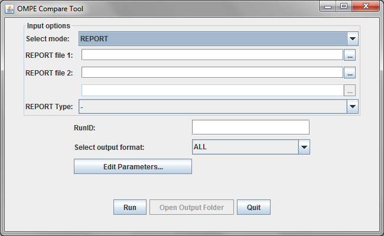

### Input Options.
		
OMPECmp Tool runs in four different modes: REPORT, CSV REPORT, HISTORY, and CSV HISTORY, which can be selected from the first combo box. To select input files, enter the file path into the text field or browse for the file by clicking on the button immediately adjacent to the field.
		
* #### Report Mode.
	
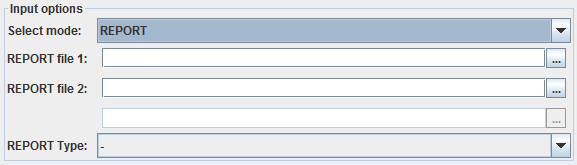
		
REPORT mode expects two input files. Data from each file will be compared side-by-side with a delta calculated between them. The first file will be considered the base values by which the deltas are calculated. The REPORT Type combo-box does not affect report processing, but configures the Parameters Editor to show the most relevant parameters when opened. 
	
* #### History Mode.
	
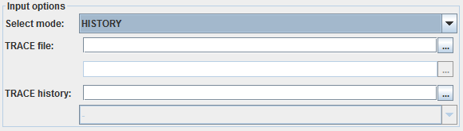
	
HISTORY mode expects at least one input TRACE file and (optionally) one TRACE history file of the type xxx_HIST.xml.
Data in the input file will be added to the data in the history file. If no history file is provided, data from the TRACE file will be added to a new history file.	

##### History Mode Batch Support

In HISTORY mode, if multiple TRACE files are selected, OMPE Compare tool will sequentially process them and add
them in turn to the history file. The resulting output file will contain TRACE data from all input TRACE files.

* #### CSV Modes.
	
CSV REPORT and CSV HISTORY work exactly like REPORT and HISTORY but expect CSV input files.
	
* #### Utility Statistics Mode.
	
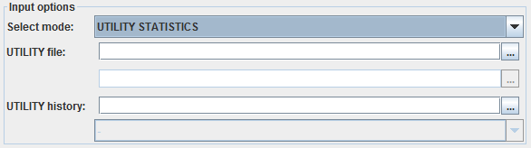
	
UTILITY STATISTICS mode expects at least one input utility statistics file and optionally one utility history file of the type xxx_US.xml. Data in the input file will be added to the data in the history file. If no history file is provided, data from the input file will be added to a new history file. 	
	
##### Utility Statistics Mode Batch Support.
	
In UTILITY STATISTICS mode, if multiple input files are provided, OMPE Compare tool will sequentially process them and add them in turn to the history file. The resulting output will contain utility statistics data from all input files.
	
### Output Options:
	
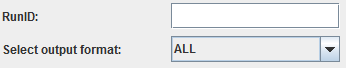
	
OMPECmp tool can produce output in html, CSV, and XML format.
	
* #### RunID:

If provided, RunID will determine the name given to the output files. If no RunID is provided, the name “output” will be used. For example, the RunID “example” will result in output files named example_AC.xml, example_ST.csv, or example_HIST.html depending on the type of report and format requested. 
		
* #### OUTPUT FORMAT

There are four choices of output format: ALL, XML, CSV, HTML. ALL will result in all three choices.
		
### Editing Parameters.
		
OMPECmp Tool parameters can be set by clicking the “Edit Parameters...” button.

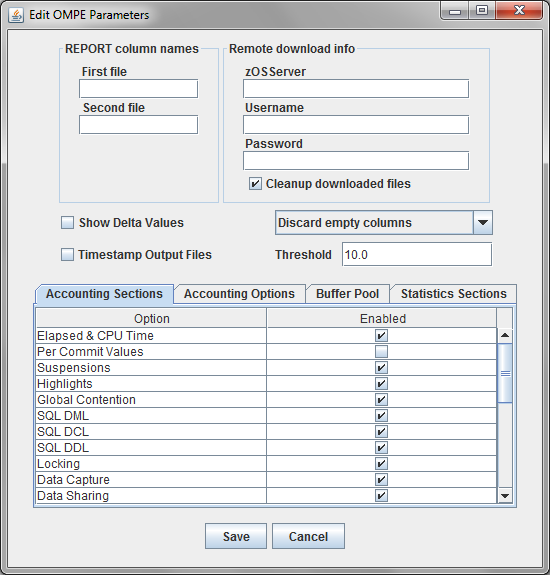
	
There are seven sections to the parameters window: Input file column names, Remote download info, Generic output options, Accounting, Statistics, Buffer Pool, and Accounting Jobs. The parameters are stored in a file named OMPECMP. parameters in the same directory as OMPECMP.jar. When no parameters file exists, a new one is created with default (mostly blank) options. 	 
	
* #### Report Column Names

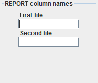

These options set the first and second column names of the output for REPORT and CSV REPORT mode. For example, if your first input file is a report for version 10 and the second a report for version 11, you may set “V10” and “V11” for the first file and second file fields respectively, and the output report will have the proper labels.
	
* #### Remote Download Information:
	
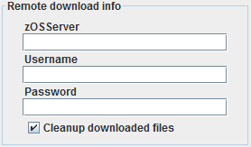
	
These options allow for the fetching of input files from a remote system such as STLMVS1. 

* #### Generic Output Options
	
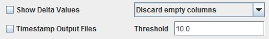
	
1. Show Delta Values shows the delta value between inputs in addition to the percent difference. If unchecked, the output only shows the percent difference.

2. The combo box presents three options. If set to “Discard empty columns”, output will not be shown with an empty DELTA(%) column. If set to “Discard columns below threshold”, output will not be shown when the DELTA(%) column is below the threshold set in the Threshold option in this section. “Show all columns” shows all of the data regardless of the value in the DELTA(%) column.

3. Timestamp Output Files adds a timestamp to the output file name of the format “MMddHHmm”.

4. Threshold is 10% by default. You can set to any number you wish.

* #### Accounting Sections

		
The Accounting Sections tab controls the accounting outputs. Metrics having checked will be used for comparison between 2 sets of report. 

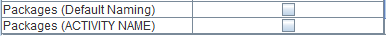

The last two options behave differently from the rest. If neither box is checked, no package information will be displayed. If the first box is checked, package information will be displayed with the default naming. If the second box is checked, package information will be displayed with naming given by ACTIVITY_NAME. If both boxes are checked, the second box will be ignored. 	 
	
 #####  Using the Packages Parameters

In the below example, the package name would be “SYSLN200” if Default Naming is selected or if neither is selected. If ACTIVITY NAME is selected, then the package name would be the data after ACTIVITY NAME except if it is 'BLANK', in which case it will use “SYSLN200.”

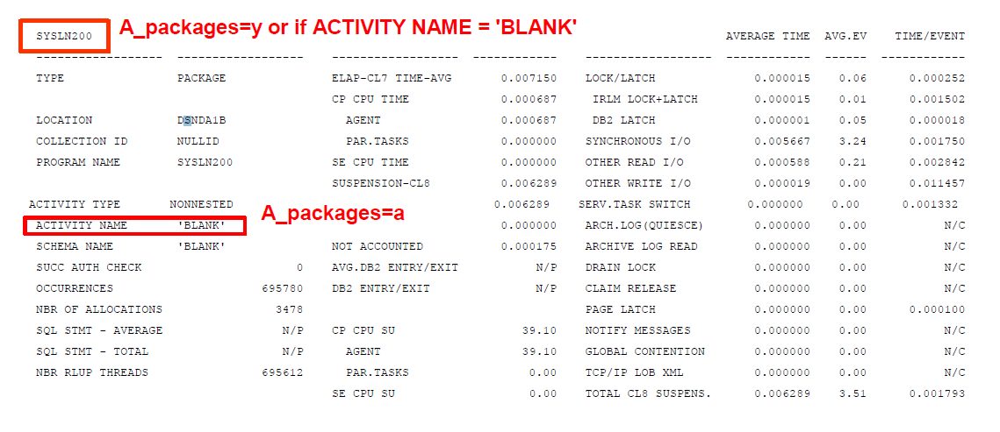

* #### Statistics Section:
	
The Statistics Sections tab controls the statistics options. Metrics having checked will be used for comparison between 2 sets of report. 
 
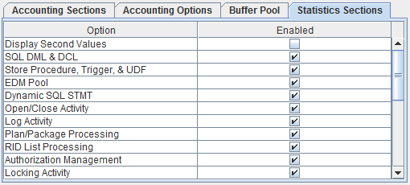 
 
* #### Buffer Pool:

The buffer pool tab controls the Buffer Pool selection for comparison between 2 sets of data. 
	
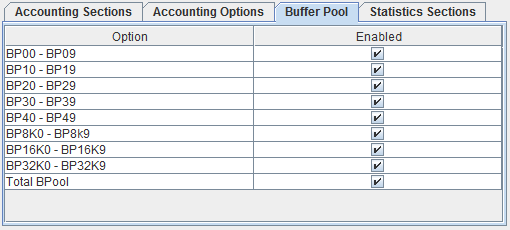
	
* #### Accounting Options
	
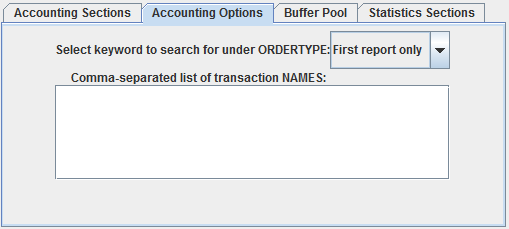
		
The Accounting Options tab consists of two options. The first combo box allows the selection of 10 different options, CONNTYPE, PLANNAME, AUTHID, CORRNAME, ACTNAME, PACKAGE, PROGRAM, INTERVAL, TRANSACT, and First report only.

The text field allows the user to list a series of NAMES for the ORDERTYPE.. 
	
##### Using ORDERTYPE and NAMES parameters 
	
These parameters should only be used when the user wishes to process the reports by CONNTYPE, PLANNAME, AUTHID, CORRNAME, ACTNAME, PACKAGE, PROGRAM, INTERVAL, or TRANSACT names. 
For instance, suppose we have an input file that has multiple CONNTYPE reports in it. Suppose the CONNTYPE for each report in the file are shown below. 
	
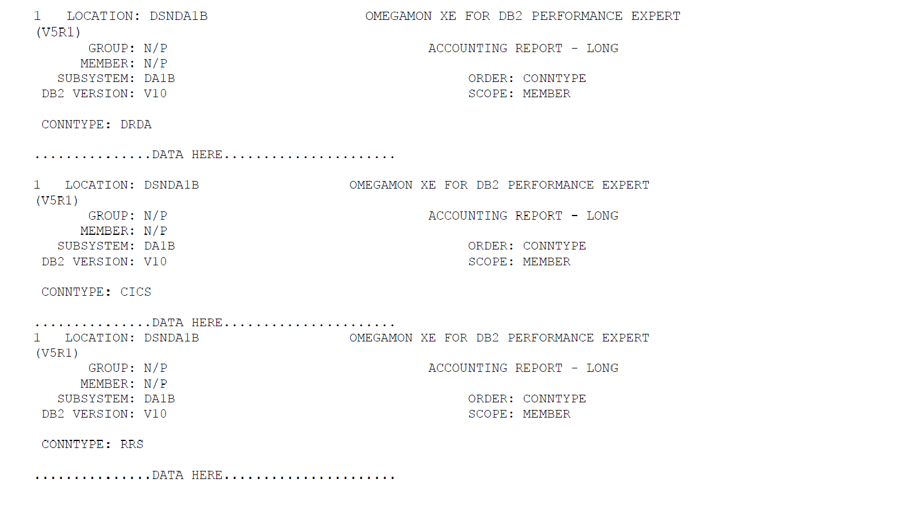
	
If we suppose there is another input file with the same report headers and wish to compare the reports from different files with matching CONNTYPE, then we must set ORDERTYPE=CONNTYPE 
	
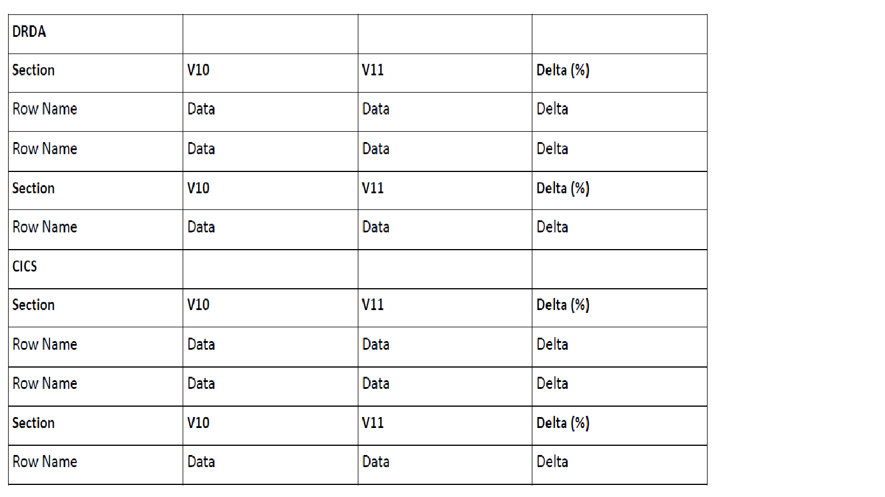
	
If you want to compare only the CNNTYPE DRDA and CICS, in the NAMES box enter: 

	DRDA, CICS 
 
In this case, the CONNTYPE RRS will be excluded from the resulting report. In this way, you can selectively compare a specific list of names (planname/authid/etc.) under an ORDERTYPE. 	
	
* ##### PARAMETER DESCRIPTIONS AND DEFAULT VALUES	

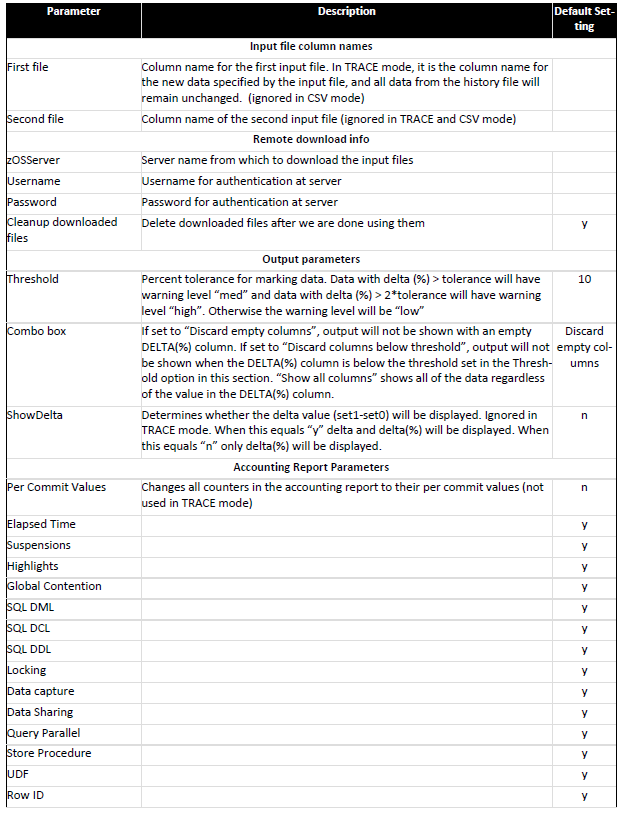
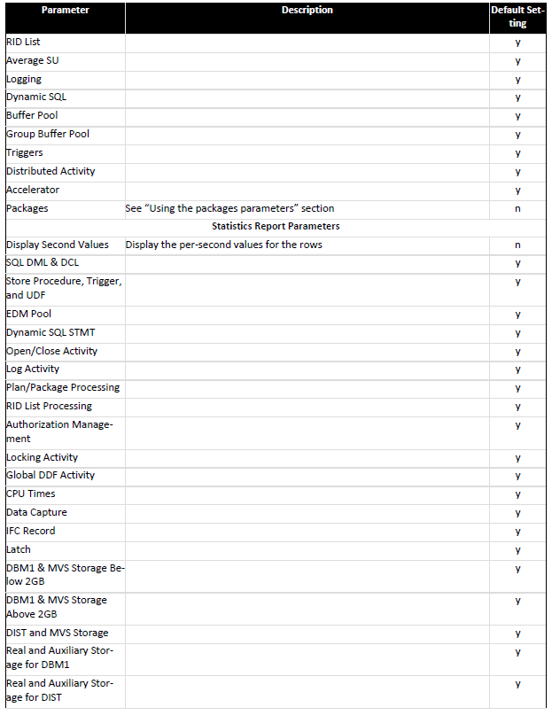

	
## Running OMPE Compare Tool	
	

	
When OMPECmp Tool has been properly configured, hit the “Run” button to run the compare operation and output the results. If any errors occur, a dialog box will be displayed to show them. 

If the output is successfully generated, the “Open Output Folder” button will be displayed to allow easy access to the output files. The output files will be placed in the same directory as the OMPE Compare Tool .JAR file. 

OMPECmp Tool outputs certain debug and log messages to standard output, and these can be viewed if necessary by launching the .JAR file from a command line
	

